## Damián Eduardo Domínguez De Barros.

## Administración y Diseño de Base de Datos, ULL 20/21

# Práctica Triggers

---

### Procedimiento y trigger crear_email.

Primero creamos un procedimiento _crear_email_ al que le pasamos un nombre, un dominio
y nos devuelve un email concatenando los datos.

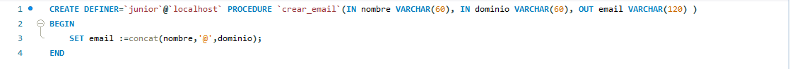

Lo siguiente será crear el trigger para que antes de insertar en la tabla Cliente, en caso
de que no se introduzca nada en el campo del email, se llame al procedimiento.

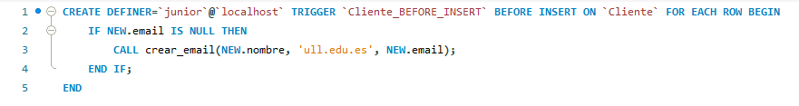

Si probamos a introducir dos personas, una sin indicar el email, comprobamos que el
procedimiento se ejecuta y le añade un email con su nombre.

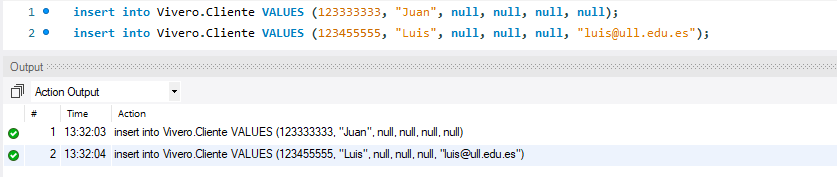

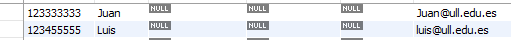

### Trigger de persona.

Para evitar que una persona pueda vivir en dos viviendas diferentes creamos un trigger
que compruebe antes de insertar si el campo que indica el número del piso o de la vivienda
no están vacíos.

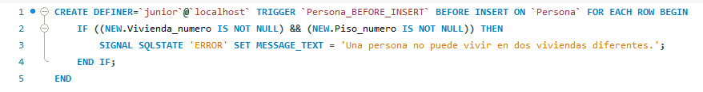

Si intentamos introducir una persona con datos en ambos campos, fallará.

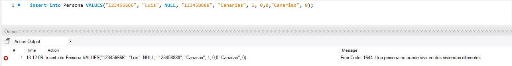

### Trigger de stock.

Para mantener actualizado el stock de los productos usaremos el siguiente trigger:

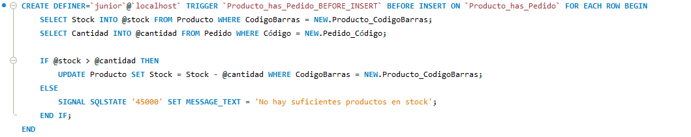

Lo que hacemos es crear dos variables *(@stock y @ cantidad)*.

-   Stock: Obtenemos el número de productos del dato que se encuentra en la tabla Producto.
-   Cantidad: Obtenemos el número de productos que se van a comprar en el pedido.

Con las dos variables comprobamos que el número de productos que tenemos es mayor que los que
se van a comprar. Sí se puede comprar actualizamos el número de productos. Si no, se lanza un
mensaje de error.

Si miramos el la tabla de productos, vemos que tenemos 3 plantas en stock.

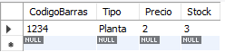

Hacemos un pedido de 2 plantas y vemos que se actualizan las plantas en stock.

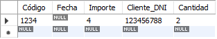

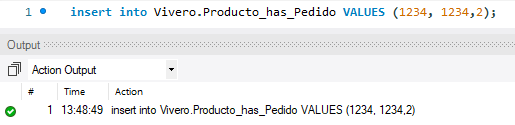

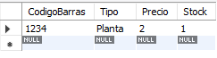

Si intentamos hacer otro pedido de dos plantas, saldrá un fallo indicando que no hay suficientes productos.

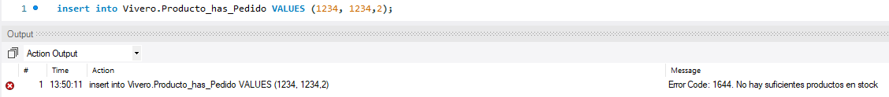

